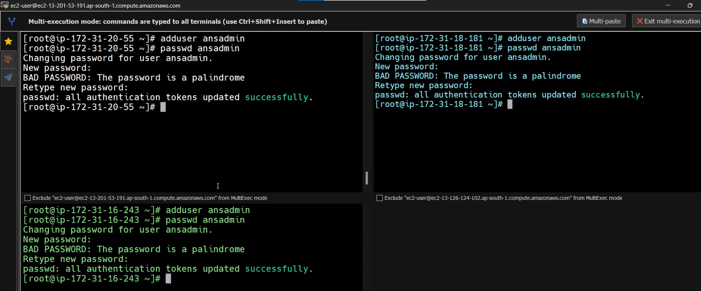
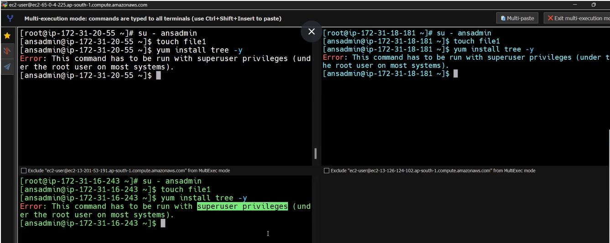
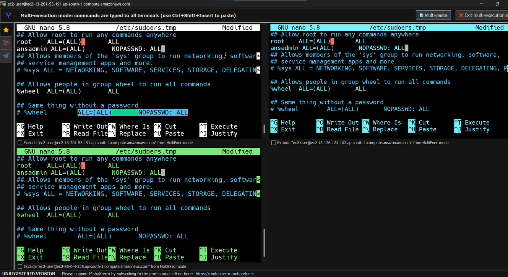
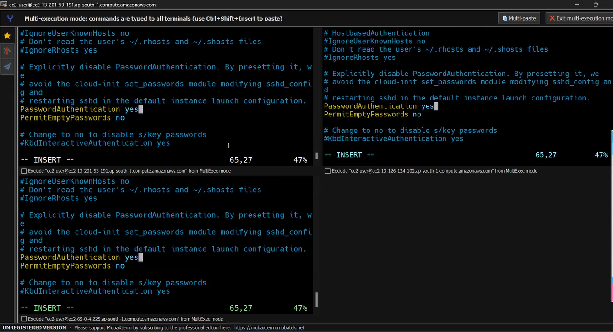

# ANSIBLE 
It is an configuration management tool to automate configurations. Same as terraform, Ansible is also used as an IAC tool.
It is an nothing but way to automate admin tasks.
Configuration management tool turns your code into infrastructure, So that our code can be testable , repeateble and versionable.

# Installation

To set up the environment for this project, follow these steps:

## Launching EC2 Instances on AWS

1. Log in to your AWS Management Console.
2. Navigate to the EC2 dashboard.
3. Launch 3 EC2 instances using the desired AMI and instance types.
4. Performing Common Tasks on EC2 Instances by connecting with Mobaxterm 
5. Using Multi-Execution Mode perform below commands

To execute common commands on all 3 EC2 instances simultaneously, follow these steps:
#### Install wget
sudo yum install wget -y

#### Download and install EPEL repository
wget http://dl.fedoraproject.org/pub/epel/epel-release-latest-7.noarch.rpm
sudo yum install epel-release-latest-7.noarch.rpm -y

#### Update the system
sudo yum update -y

#### Install git, Python, Python development tools, pip, OpenSSL, and Ansible
sudo yum install git python python-devel python-pip openssl ansible -y

#### Verify Ansible installation
ansible --version
#### And follow below commands

1. Install wget and update packages:
   

2. Download and install EPEL repository:
   

3. After executing command of visudo below window will be opened, add user list like below:
   

4. To establish SSH connection among all 3 instances, edit sshd_config file:
   

5. Reload the changes made in sshd_config file by command:
   ```bash
   sudo service sshd reload


## Some important concepts of Ansible :~:
1. Server: - It is the place where we create playbooks and write code in YML format
2. Setup: - It is a module in ansible which gathers nodes information.
3. ssh: - It is an agent through ansible server pushes code to nodes.
4. Node: - It is the place where we apply code to create infrastructure. Server pushes code to nodes.
5. Inventory file: - In this file we keep IP/DNS of nodes.
6. Target section: - We mention the group name which contains either IP addresses or Hostnames of nodes.We use "all" key word to refer all groups.
7. Task section: - We are going to mention list of all modules. All tasks we mention in this task section. We can mention any no of modules in one playbook.
8. Variable section: - We are going to mention variables using keyword "vars". Instead of hard coding, we can mention as variables so that during runtime it pulls the actual value in place of key.
9. Handler section: - All tasks we mention in tasks section. But some tasks where dependency is there, we should not mention in tasks section. For example -installing package is one task and starting service is one more task. But there is dependency between them. I.e. after installing package only, we have to start serviceThese kind of tasks, we mention in handler section.Here,package task we mention in task section and service task we mention in handler section so that after installing task only service will be started.
10. Loops: - If for instance, Installing multiple packages, Creating many users, creation many groups..etc are required tasks then using variables in combination with loops can make our efforts much less.
11. Vault: -The way of protecting playbooks by encrypting them, to hide confidential info  like- passwords, keys ...etc.
12. Roles: - Creating separate file to each section and just mentioning the names of those sections in playbook instead of mentioning all modules in main playbook, we can maintain small playbook without any complexity.When you call main playbook, main playbook will call all sections files respectively in the order whatever order you mention in playbook

